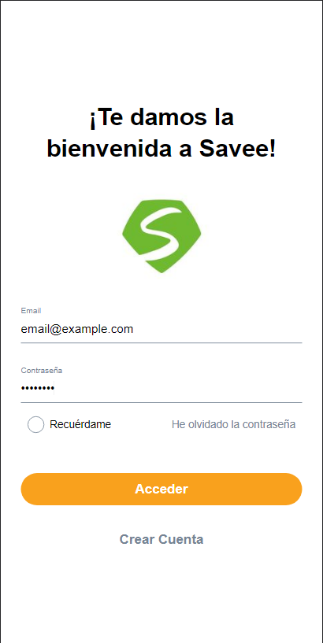
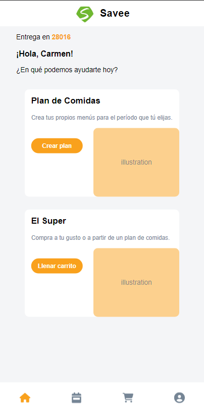
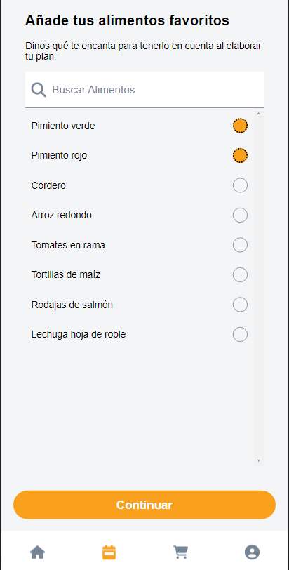
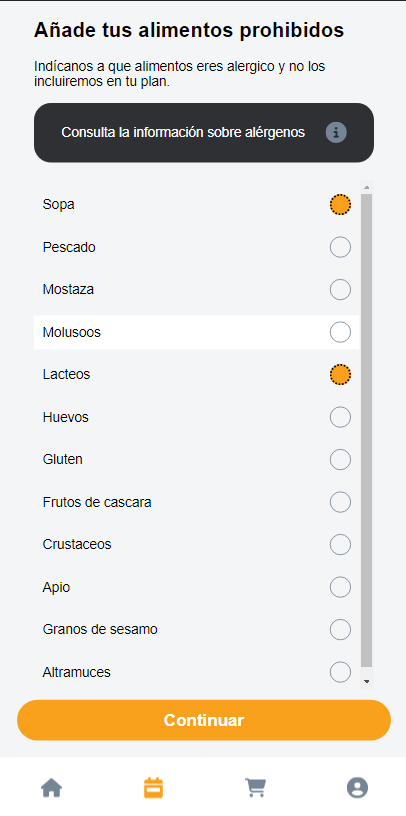
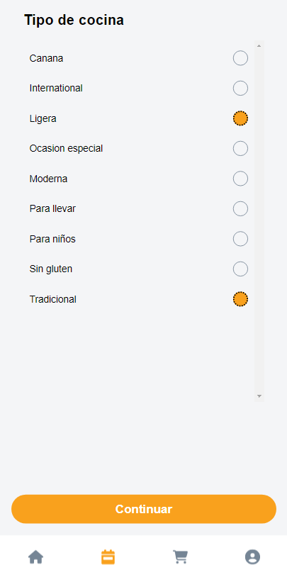
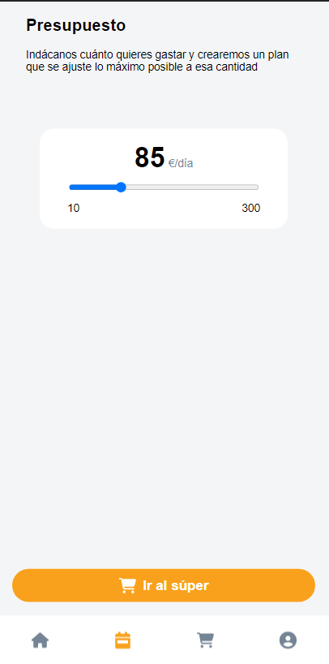
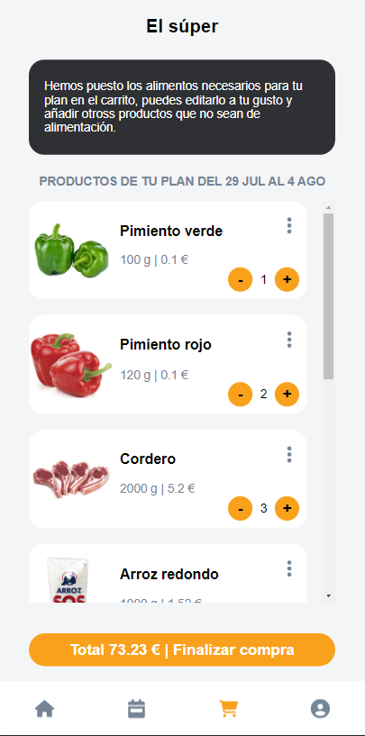
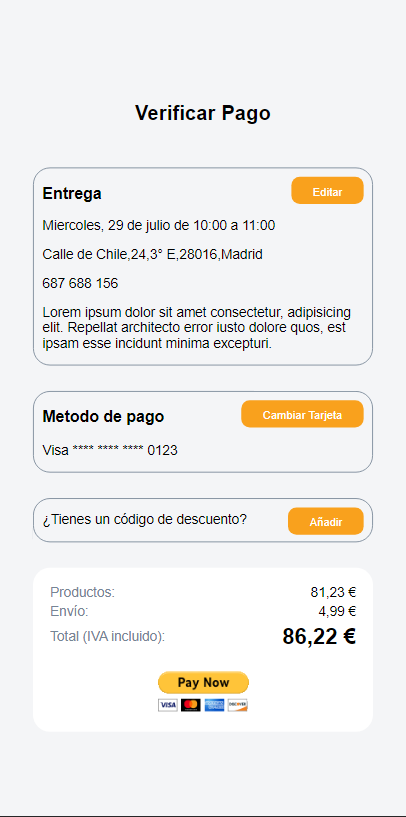
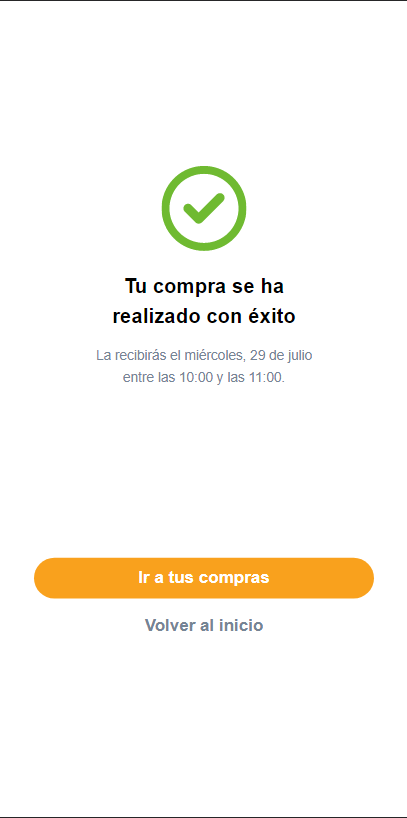

# App Savee

Aplicación web movil para la generación de lista de compras de alimentos.

### Demo &#x279c; [https://app-savee.netlify.app/](https://app-savee.netlify.app/)

## Vistas Generadas

- Login
- Varias pantallas con petición de datos para generar un plan de alimentación.
- Una pantalla con una selección de productos a modo de carrito de compras.
- Un botón de pago de paypal, como pasarela de pago.

## Probar Aplicación

Para emular el comportamiento de la aplicación debe realizar los siguientes pasos:

- Debe dirigerse a la ruta `URL/login` y llenar los campos de correo y contraseña con cualquier texto, luego el boton se activará y al pulsarlo se mostrará la vista `Home`.



- En la vista de `Home` deberá presionar el boton `Crear plan` ubicado en la primera tarjeta. Luego deberá preparar un plan de alimentación, se mostrarán varias vistas donde deberá presionar el boton continuar para avanzar. Por último se mostrará un boton `Ir al súper` que desplegará la vista de `Shopping`.







- En la vista `Shopping` podrá ver una lista de alimentos con sus detalles y podrá seleccionar la cantidad que desee, luego deberá presionar el boton `Finalizar compra` para desplegar la vista de `Payment`.



- En la vista de `Payment` se mostrará información respecto al proceso de pago, al final se muestra un `boton de pago de paypal`, al precionarlo la página lo redireccionará a la página de pago de Paypal. En este punto deberá usar la función de regresar de su navegador web, cuando lo haga se mostrará la ultima vista `PaymentSuccess`. De no mostrarse, deberá ir manualmente a la ruta: `URL/payment-success` para visualizarla.




## Mockup de Datos

Los datos de prueba usados para renderizar las vistas antes mostradas se obtuvieron desde archivos `json` ubicados en la ruta [/src/mocks](./src/mocks/)

- food.json
```json
[
  {
    "name": "Pimiento rojo",
    "qty": 120,
    "price": 0.10,
    "image": "https://guadanatura.es/wp-content/uploads/2020/08/pimientos-california-rojo.jpg"
  },
  { ... }
]
```

- allergens.json
```json
[
  "Sopa",
  "Pescado",
  "Mostaza",
  "Molusoos",
  "Lacteos",
  "Huevos",
  "Gluten",
  "Frutos de cascara",
  "Crustaceos",
  "Apio",
  "Granos de sesamo",
  "Altramuces"
]
```

- kitchen.json
```json
[
  "Canana",
  "International",
  "Ligera",
  "Ocasion especial",
  "Moderna",
  "Para llevar",
  "Para niños",
  "Sin gluten",
  "Tradicional"
]
```

## Lista de Comandos
```sh
# Ejecutar en modo desarrollo
yarn dev

# Compilar app a producción
yarn build

# Ejecutar en modo producción
yarn preview

# Formatear todo el código usando prettier
yarn format
```
